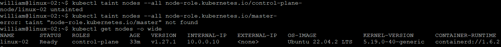
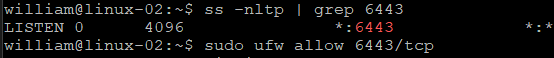
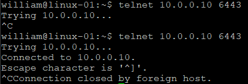
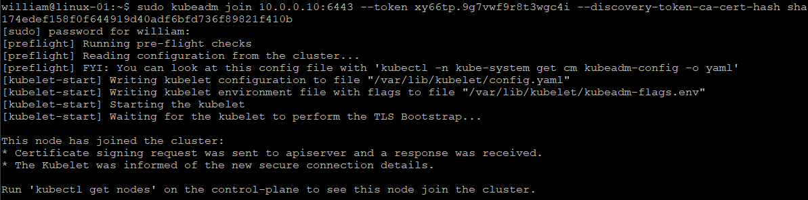
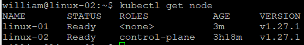

# k8s-kubeadm-calico
Installing and configuring kubernetes clusters on ubuntu using kubeadm, calico, etc.

## 1. Check ubuntu version

    lsb_release -a

## 2. Clean up minikube if installed

    minikube delete --all --purge

    sudo rm -r /usr/local/bin/minikube

Restart machine after executing the above commands.

## 3. Installing kubeadm, kubelet and kubectl

### (1). Update the apt package index and install packages needed to use the Kubernetes apt repository:

    sudo apt-get update

    sudo apt-get install -y apt-transport-https ca-certificates curl

### (2). Download the Google Cloud public signing key:

    sudo curl -fsSLo /etc/apt/keyrings/kubernetes-archive-keyring.gpg https://packages.cloud.google.com/apt/doc/apt-key.gpg

### (3). Add the Kubernetes apt repository:

    echo "deb [signed-by=/etc/apt/keyrings/kubernetes-archive-keyring.gpg] https://apt.kubernetes.io/ kubernetes-xenial main" | sudo tee /etc/apt/sources.list.d/kubernetes.list

### (4). Update apt package index, install kubelet, kubeadm and kubectl, and pin their version:

    sudo apt-get update

    sudo apt-get install -y kubelet kubeadm kubectl

    sudo apt-mark hold kubelet kubeadm kubectl

## 4. Reset and/or uninstall k8s

    sudo kubeadm reset

    sudo apt-get purge kubeadm kubectl kubelet kubernetes-cni kube*   

    sudo apt-get autoremove  

    sudo rm -rf ~/.kube

## 5. Create a single-host Kubernetes cluster with kubeadm

    sudo kubeadm init --apiserver-advertise-address=10.0.0.10 --pod-network-cidr=192.168.0.0/16

    mkdir -p $HOME/.kube

    sudo cp -i /etc/kubernetes/admin.conf $HOME/.kube/config

    sudo chown $(id -u):$(id -g) $HOME/.kube/config

## 6. Install Calico

### (1). Install the Tigera Calico operator and custom resource definitions.

    kubectl create -f https://raw.githubusercontent.com/projectcalico/calico/v3.25.1/manifests/tigera-operator.yaml

### (2). Install Calico by creating the necessary custom resource.

    kubectl create -f https://raw.githubusercontent.com/projectcalico/calico/v3.25.1/manifests/custom-resources.yaml

### (3). Confirm that all of the pods are running with the following command

    watch kubectl get pods -n calico-system

### (4). Remove the taints on the control plane so that you can schedule pods on it.

    kubectl taint nodes --all node-role.kubernetes.io/control-plane-

    kubectl taint nodes --all node-role.kubernetes.io/master-

    kubectl get nodes -o wide

## 7. Joining worker node

After initializing control plane, it would show the following statement with actual values:

    sudo kubeadm join < control-plane-host >:< control-plane-port > --token < token >  --discovery-token-ca-cert-hash sha256:< hash >

For example,

    kubeadm join 10.0.0.10:6443 --token w0ogsf.f19yfw83v0py0uav \
    --discovery-token-ca-cert-hash sha256:61b25f8e9f5f194b1a53c467e1e4f11f8cd417950442de11b703bd95e9b2cecb

## 8. Troubleshooting

### (1). Cann't join node

[preflight] Running pre-flight checks
error execution phase preflight: couldn't validate the identity of the API Server: Get "https://10.0.0.10:6443/api/v1/namespaces/kube-public/configmaps/cluster-info?timeout=10s": net/http: request canceled while waiting for connection (Client.Timeout exceeded while awaiting headers)
To see the stack trace of this error execute with --v=5 or higher

Resovled by enabling port 6443 on control plane ( linux-02 ):

After that, another node ( linux-01 ) was joined successfully.

### (2). For TLS certificate errors, overwrite the existing kubeconfig for the "admin" user:

    mv  $HOME/.kube $HOME/.kube.bak

    mkdir $HOME/.kube

    sudo cp -i /etc/kubernetes/admin.conf $HOME/.kube/config

    sudo chown $(id -u):$(id -g) $HOME/.kube/config

### (3). Can't enable Calico

Unable to connect to the server: tls: failed to verify certificate: x509: certificate signed by unknown authority (possibly because of "crypto/rsa: verification error" while trying to verify candidate authority certificate "kubernetes")

see (2)

### (4). kubectl not working on worker node

kubectl get pods
E0427 22:03:20.933445   98616 memcache.go:265] couldn't get current server API group list: Get "http://localhost:8080/api?timeout=32s": dial tcp 127.0.0.1:8080: connect: connection refused

&nbsp;

Kubcetl is by default configured and working on the master. It requires a kube-apiserver pod and ~/.kube/config.

For worker nodes, we don’t need to install kube-apiserver but need to copy the ~/.kube/config file from the master node to the ~/.kube/config on the worker node so that it can call kube-apiserver at https://10.0.0.10:6443.

&nbsp;

## 9. References

https://kubernetes.io/docs/setup/production-environment/tools/kubeadm/install-kubeadm/

https://kubernetes.io/docs/setup/production-environment/tools/kubeadm/create-cluster-kubeadm/
