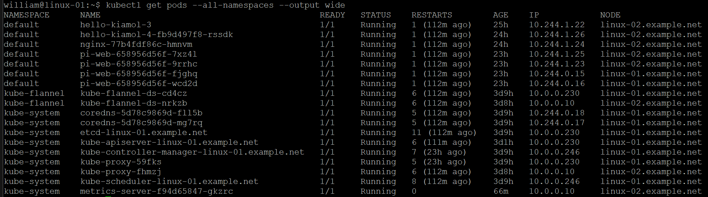
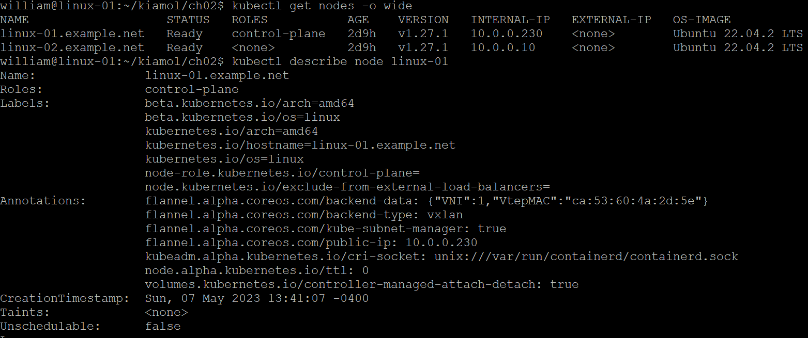

# k8s-kubeadm-flannel
Installing and configuring kubernetes clusters on ubuntu using kubeadm, flannel, etc.

## 1. Check ubuntu version

    lsb_release -a

## 2. Clean up minikube if installed

    minikube delete --all --purge

    sudo rm -r /usr/local/bin/minikube

Restart machine after executing the above commands.

## 3. Installing kubeadm, kubelet and kubectl

### (1). Update the apt package index and install packages needed to use the Kubernetes apt repository:

    sudo apt-get update

    sudo apt-get install -y apt-transport-https ca-certificates curl

### (2). Download the Google Cloud public signing key:

    sudo curl -fsSLo /etc/apt/keyrings/kubernetes-archive-keyring.gpg https://packages.cloud.google.com/apt/doc/apt-key.gpg

### (3). Add the Kubernetes apt repository:

    echo "deb [signed-by=/etc/apt/keyrings/kubernetes-archive-keyring.gpg] https://apt.kubernetes.io/ kubernetes-xenial main" | sudo tee /etc/apt/sources.list.d/kubernetes.list

### (4). Update apt package index, install kubelet, kubeadm and kubectl, and pin their version:

    sudo apt-get update

    sudo apt-get install -y kubelet kubeadm kubectl

    sudo apt-mark hold kubelet kubeadm kubectl

## 4. Reset and/or uninstall k8s

    sudo kubeadm reset

    sudo apt-get purge kubeadm kubectl kubelet kubernetes-cni kube*   

    sudo apt-get autoremove  

    sudo rm -rf ~/.kube

## 5. Create a single-host Kubernetes cluster with kubeadm (to use default pod network ip range for flannel: podCIDR=10.244.0.0/16)

Note: The --pod-network-cidr=10.244.0.0/16 option is a requirement for Flannel - don't change that network address!

    sudo kubeadm init --apiserver-advertise-address=10.0.0.230 --pod-network-cidr=10.244.0.0/16

    mkdir -p $HOME/.kube

    sudo cp -i /etc/kubernetes/admin.conf $HOME/.kube/config

    sudo chown $(id -u):$(id -g) $HOME/.kube/config

## 6. Install Flannel

### (1). For Kubernetes v1.17+, deploying Flannel with kubectl
If you use custom podCIDR (not 10.244.0.0/16), you first need to download the following manifest and modify the network to match your one.

    kubectl apply -f https://github.com/flannel-io/flannel/releases/latest/download/kube-flannel.yml

### (2). Enable these ports in firewall

    sudo ufw allow 6443
    sudo ufw allow 6443/tcp

    sudo ufw allow 10250
    sudo ufw allow 10250/tcp

### (3). Confirm that all of the pods are running with the following command

### (4). Remove the taints on the control plane so that you can schedule pods on it.

    kubectl taint nodes --all node-role.kubernetes.io/control-plane-

    kubectl get nodes -o wide

## 7. Joining worker node

After initializing control plane, it would show the following statement with actual values:

    sudo kubeadm join < control-plane-host >:< control-plane-port > --token < token >  --discovery-token-ca-cert-hash sha256:< hash >

For example,

## 8. Installing Metrics Server using Helm charts

(1). Installing Helm

    curl https://baltocdn.com/helm/signing.asc | gpg --dearmor | sudo tee /usr/share/keyrings/helm.gpg > /dev/null
    sudo apt-get install apt-transport-https --yes
    echo "deb [arch=$(dpkg --print-architecture) signed-by=/usr/share/keyrings/helm.gpg] https://baltocdn.com/helm/stable/debian/ all main" | sudo tee /etc/apt/sources.list.d/helm-stable-debian.list
    sudo apt-get update
    sudo apt-get install helm

(2). Add the Metrics Server Helm charts repo to Helm and then install

    kubectl create ns metrics-server
    kubectl config set-context $(kubectl config current-context) --namespace=metrics-server
    helm repo add metrics-server https://kubernetes-sigs.github.io/metrics-server/
    helm upgrade
    helm show values metrics-server/metrics-server > ~/metrics-server.values
    helm install metrics-server metrics-server/metrics-server -n  metrics-server --values ~/metrics-server.values
    helm ls -n metrics-server
    

## 9. Troubleshooting

### (1). Cann't join node

[preflight] Running pre-flight checks
error execution phase preflight: couldn't validate the identity of the API Server: Get "https://10.0.0.10:6443/api/v1/namespaces/kube-public/configmaps/cluster-info?timeout=10s": net/http: request canceled while waiting for connection (Client.Timeout exceeded while awaiting headers)
To see the stack trace of this error execute with --v=5 or higher

Resovled by enabling port 6443 on both nodes:

After that, another node ( linux-02 ) was joined successfully.

### (2). For TLS certificate errors, overwrite the existing kubeconfig for the "admin" user:

    mv  $HOME/.kube $HOME/.kube.bak

    mkdir $HOME/.kube

    sudo cp -i /etc/kubernetes/admin.conf $HOME/.kube/config

    sudo chown $(id -u):$(id -g) $HOME/.kube/config

### (3). kubectl not working on worker node

kubectl get pods
E0427 22:03:20.933445   98616 memcache.go:265] couldn't get current server API group list: Get "http://localhost:8080/api?timeout=32s": dial tcp 127.0.0.1:8080: connect: connection refused

&nbsp;

Kubcetl is by default configured and working on the master. It requires a kube-apiserver pod and ~/.kube/config.

For worker nodes, we don’t need to install kube-apiserver but need to copy the ~/.kube/config file from the master node to the ~/.kube/config on the worker node so that it can call kube-apiserver at https://10.0.0.10:6443.

&nbsp;

## 10. References

https://kubernetes.io/docs/setup/production-environment/tools/kubeadm/install-kubeadm/

https://kubernetes.io/docs/setup/production-environment/tools/kubeadm/create-cluster-kubeadm/

https://helm.sh/docs/intro/install/

https://artifacthub.io/packages/helm/metrics-server/metrics-server

https://github.com/flannel-io/flannel#deploying-flannel-manually
